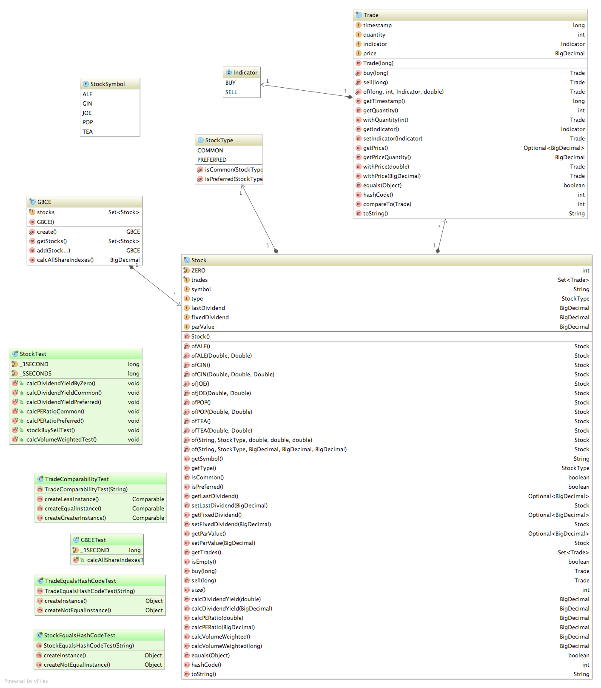

# Super Simple Stock Market

The Global Beverage Corporation Exchange is a new stock market trading in drinks companies.
a. Your company is building the object-oriented system to run that trading.
b. You have been assigned to build part of the core object model for a limited phase 1

### Requirement

* Issue [#1](https://github.com/emprestes/sssm/issues/1)

### Analysis and Project

### Development

* Using [Java language](https://docs.oracle.com/javase/tutorial) to implement domain model objects.
* Testing using [JUnit](http://junit.org/junit4).
* Building with [Apache Maven](http://maven.apache.org).

### Running and testing

Using Apache Maven on a terminal.

`$ mvn clean install`

